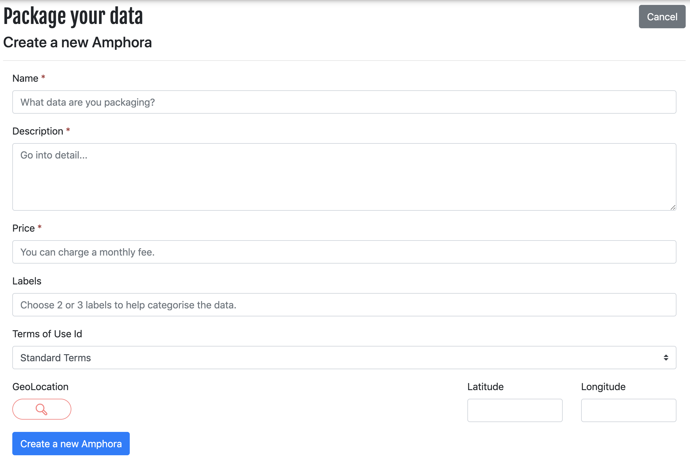

An Amphora is a standardised data containers. To share your data, you need to create an Amphora then fill it with whatever data you want.

## Create the Amphora

Navigate to the `Share` page, and you will get the screen below

> At this stage, you can describe the Amphora, but *not yet* add any data. That comes later.

Give your Amphora a Name, Description, Price, and Geo-Location. You can search for locations, or just enter the Lat/Lon manually. These need to be entered into the fields below. You should also label it with data type, crop type etc and also select the appropriate Terms and Conditions.

As Amphoras have standardised metadata, please ensure all fields are correct so others can find and use your Amphora.

## Set terms and conditions

You can set the terms and conditions for each Amphora when you create it. You can either do this with the web interface or programatically with the API (just use the right ID).

If you need to create a new terms and conditions document, you can create it in your organisation page.

## Tips for best practice

There are several key features to include when creating a comprehensive and descriptive Amphora:

#### Name

* Be descriptive but concise about the information contained in the Amphora

* Include the region, with state if applicable

* Try to avoid overly technical terms where possible*

#### Description:

* Indicate where the data came from, including all sources, and what the target region is.
* Describe each signal contained in the Amphora including units.

#### Price:
* Be sure to put the correct monthly cost, or 0 for free data

#### Labels:
* Add several relevant labels to make searching processes easier. Include:

    * structure of the data (e.g. tabular, image, time series)
    * the data type (e.g. weather, NDVI)
    *  any other relevant information (e.g. crop type)

#### Ts&Cs:

* Check documents associated with the data source and publish the data under the right terms and conditions

* Go to your organisation homepage and add new T&Cs if the required Ts&Cs aren't already listed

####  GeoLocation:

* Use the search bar or directly enter latitude and longitude of the region for which the data are aggregated
*  If there is no specific region for the Amphora then use the location of the body which generated the data (e.g. using the MLA office in North Sydney for their nation wide livestock data)

