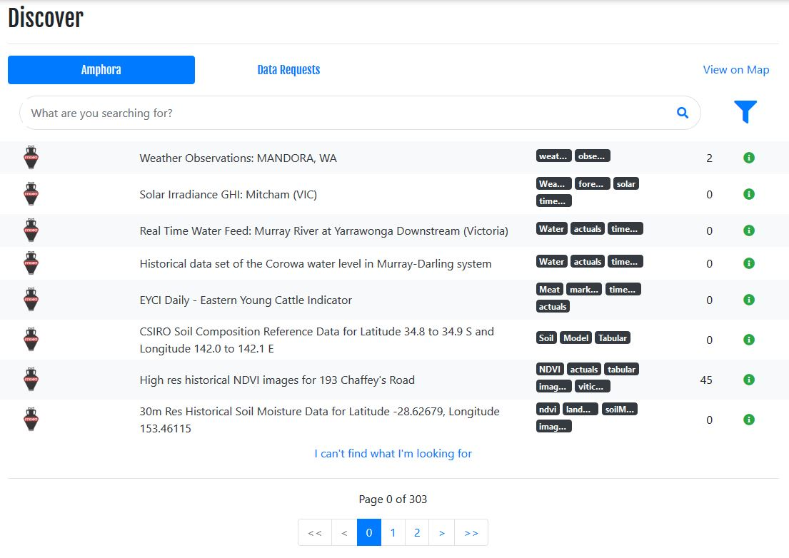

> Amphora Data is currently in beta. These documents may change.

## Find an Amphora

To find an Amphora, click Discover in the header, then search for key words, tags or locations. This will bring up a list of matching Amphora. 

## Buy an Amphora

To access any data in an Amphora, you need to purchase it. Many Amphora don't cost anything but still need to be purchased. Purchase the Amphora you want by clicking the `Buy` button in the top right of the Amphora page. 

You may need to accept the terms and conditions of the Amphora. These terms and conditions govern the use of the data and must be adhered to -  please read them carefully.

After you purchase the Amphora, it will show up on your organisation profile as a Debit.

