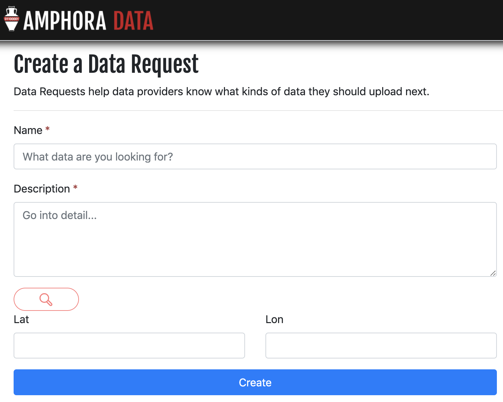

Sometimes an Amphora contains only some of the data you want, or in a format your not familar with. You can raise a request to the Amphora owner to create a new Amphora for you.

## Raise a data request

If you want specific data but can't find it on the Amphora platform, you can ask users to find it by clicking `I can't find what I'm looking for` at the bottom the `Discover` page. This will take you to a page shown below.

Simply fill out as much information as you can and click `Create`

This will raise a data request for all users of the platform to see

## View existing data requests

You can view all existing data requests by clicking `Data Requests` of the `Discover` page. This returns a list of searchable data requests similar to the list of current Amphoras.
