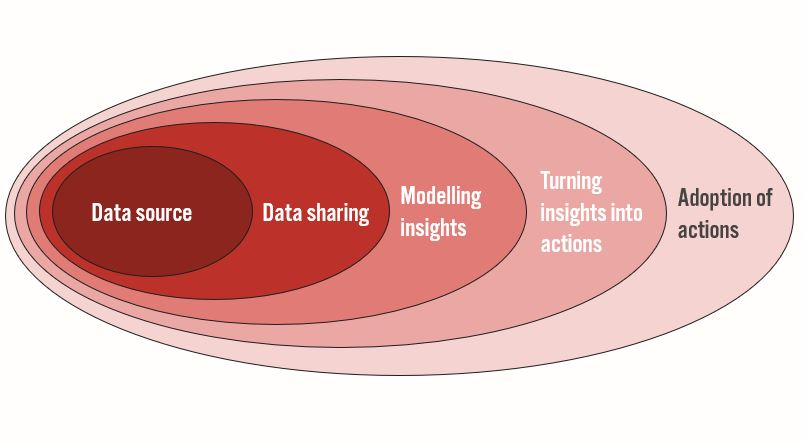
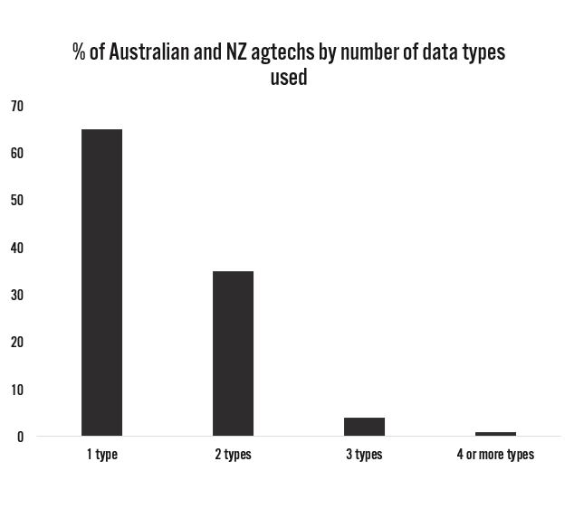

### What sharing data achieves

#### Sharing data improves on-farm outcomes and experience for farmers

Advanced analytics and reporting has the potential to unlock over 700 billion dollars in annual earnings in the agricultural sector. This opportunity will transform farming but needs extensive operational data. The sources of value for such data exploration are known, but data sharing is nascent. Currently, data is tightly held within single companies – this must change. 

To capture this potential, farmers need to turn modelling insights into on-farm action and adoption. This requires simplified, easy to use interfaces which are currently not prevalent. Farmers regularly use far too many digital tools with very specific functionality, resulting in an increasing frustration with technological change. Data sharing fixes this by supporting increased functionality of software platforms.

#### Data providers get additional revenue from sharing data and reduced back-end IT costs, maximising the value of their data and helping them focus on building great hardware

Data providers — those that capture data — access an entirely new market through sharing data. They are able to use the data collected to generate new revenue streams, which improves their business model. Data providers can focus on building better data collecting hardware, rather than end-user software, as they can now capture value from data collection. Additionally, sharing data can help data providers simplify their back-end IT systems by decreasing cloud spend.

#### Data users can increase revenue and growth through better analytics software and less focus on hardware development

Data users — those that turn data into insight — get the fuel they need to do more advanced analytics and reporting. This helps them attract new customers, retain existing ones and increase prices from extra functionality; all increasing revenue and growth. Additionally, they can reduce R&D on data collection hardware by simply acquiring the data through a sharing platform. This reduces the time between demand and supply of data.

### Why we should share data
#### Sharing data helps improve modelling insights and reporting

Data is the fuel for machine learning, business intelligence, and any other type of analytics. Analytics works best with a combination of data types, including field sensors, images, telematics, worker entries, geolocation and more — this is currently not the case within agriculture.

In Australia and NZ, two thirds of agtech companies use only one type of data, and less than 1% use more than three. We need to share data to increase the range of information used and improve analytics insights.

#### Simplifying integration reduces software development and data engineering effort

Too much effort in software development and data engineering is spent on integration. What’s worse, the effort is often duplicated on every stack. This includes not only building reliable, scalable, and low-latency databases, but also data wrangling efforts like complex joins, de-duplication, formatting, and quality assurance. 

Sharing data transparently on a unified user-oriented platform provides quality data from a single integration point.

#### Selective permissioning balances open collaboration and competitive advantage

Permissioning when sharing data is often incorrectly seen as a mutually-exclusive choice between completely open or completely closed. 

By verifying users, permissions can be set by data providers so that partners can collaborate easily on some data, but not highly sensitive data and competitors can’t see anything. This selective permissioning also supports adherence to customer terms and conditions.

### How we share data effectively
#### Data should be licensed to protect rights of data owners and respect privacy

Sharing data is not transferring data ownership. Usage of data can be set in the specific license. This helps maintain and protect the rights of the data owners, whether they be farmers or companies, as well as ensure data is used within appropriate privacy constraints. Enforcement of proper usage of data can be done through the triad of technology, law and commerce.

#### Valuing reputation is critical for trusted trading and sharing

Trading and sharing are underpinned by trust and reputation. Trading on an open floor only works because all participants trust each other, or the institution, to follow through on each trade.

Verifying users and valuing their reputation is possible and can be done easily in a sophisticated sharing platform.

#### Pricing data fairly and intelligently increases data collection and effective use

Economic history shows that once we price something, we can appreciate its real value. Although its importance is widely understood, operational data is generally not priced, which limits how much is collected and used. Pricing data when it is shared through a marketplace sends a clear signal that data has tangible value. This will be a catalyst to deliver on the transformational opportunity of analytics in agriculture. 