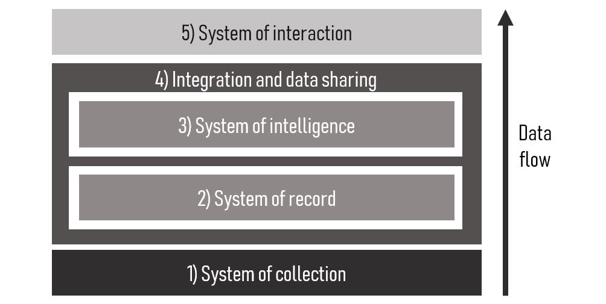

Agricultural technology is advancing rapidly. Within the last 5 years we have seen advancement in analytics, IoT and smart machinery roll out across farms, and this progress is speeding up.

Despite this progress, agriculture technology still lags other industries including banking and manufacturing. Currently, agricultural technology is very vertically integrated, with single companies owning a use case from data collection through to insights for the farmer. 

However, this is now changing. The agricultural technology stack is moving towards a traditional enterprise design. 

A changing tech stack provides lots of opportunity for agtechs to improve and optimise their products. Most importantly, farmers will tremendously benefit from simpler, cheaper, smarter and faster products including technology and analytics.

